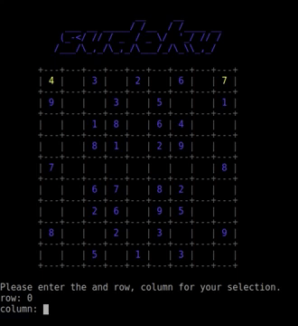

# sudoku

A sudoku game you can play in the terminal.

The object of the game is to fill in each open square so that each of the digits 
1-9 occurs once in each row and column.

### How to Play

1. Download the folder from github and extract the folder.

2. Open your terminal, navigate to the sudoku folder, then enter:
  ```
  ruby sudoku.rb
  ```
3. Type in the row, column and value for the square you would like to fill in.

4. Continue to fill in squares until no empty squares remain.


Have fun! :)


